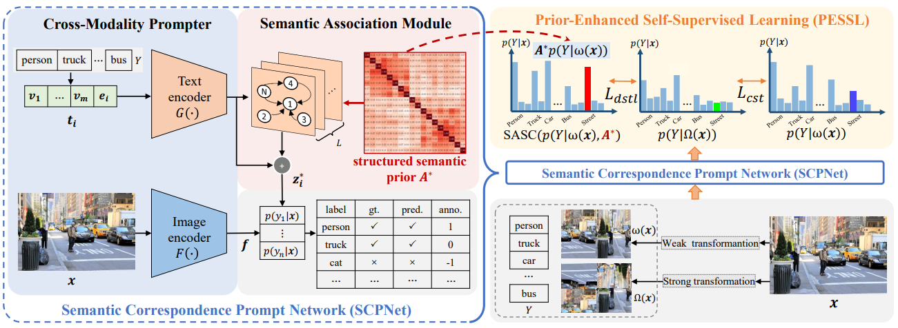

# [Exploring Structured Semantic Prior for Multi Label Recognition with Incomplete Labels](https://openaccess.thecvf.com/content/CVPR2023/papers/Ding_Exploring_Structured_Semantic_Prior_for_Multi_Label_Recognition_With_Incomplete_CVPR_2023_paper.pdf)

Official PyTorch Implementation of **SCPNet**, from the following paper:

[Exploring Structured Semantic Prior
for Multi Label Recognition with Incomplete Labels](https://openaccess.thecvf.com/content/CVPR2023/papers/Ding_Exploring_Structured_Semantic_Prior_for_Multi_Label_Recognition_With_Incomplete_CVPR_2023_paper.pdf). CVPR 2023.

> Zixuan Ding*, Ao Wang*, Hui Chen†, Qiang Zhang, Pengzhang Liu, Yongjun Bao, Weipeng Yan, Jungong Han,
> <br/> Xidian University, Tsinghua University, JD.com


**Abstract**

Multi-label recognition (MLR) with incomplete labels is very challenging. Recent works strive to explore the imageto-label correspondence in the vision-language model, i.e., CLIP, to compensate for insufficient annotations. In spite of promising performance, they generally overlook the
valuable prior about the label-to-label correspondence. In this paper, we advocate remedying the deficiency of label supervision for the MLR with incomplete labels by deriving a structured semantic prior about the label-to-label correspondence via a semantic prior prompter. We then present a novel Semantic Correspondence Prompt Network (SCPNet), which can thoroughly explore the structured semantic prior. A Prior-Enhanced Self-Supervised Learning method is further introduced to enhance the use of the prior. Comprehensive experiments and analyses on several widely used
benchmark datasets show that our method significantly outperforms existing methods on all datasets, well demonstrating the effectiveness and the superiority of our method.

<p align="center">
 <table class="tg">
  <tr>
    <td class="tg-c3ow"></td>
  </tr>
</table>
</p>


## Credit to previous work
This repository is built upon the code base of [ASL](https://github.com/Alibaba-MIIL/ASL) and [SPLC](https://github.com/xinyu1205/robust-loss-mlml), thanks very much!

## Performance

| Dataset | mAP | Ckpt | Log |
|:---: | :---: | :---: | :---: |
| COCO | 76.4 | [scpnet+coco.ckpt](https://github.com/jameslahm/SCPNet/releases/download/v1.0/scpnet+coco.ckpt)  | [scpnet+coco.txt](logs/scpnet+coco.txt) |
| VOC | 91.2 | [scpnet+voc.ckpt](https://github.com/jameslahm/SCPNet/releases/download/v1.0/scpnet+voc.ckpt) | [scpnet+voc.txt](logs/scpnet+voc.txt) |
| NUSWIDE | 62.0 | [scpnet+nuswide.ckpt](https://github.com/jameslahm/SCPNet/releases/download/v1.0/scpnet+nuswide.ckpt)  | [scpnet+nuswide.txt](logs/scpnet+nuswide.txt) |
| CUB | 25.7 | [scpnet+cub.ckpt](https://github.com/jameslahm/SCPNet/releases/download/v1.0/scpnet+cub.ckpt) | [scpnet+cub.txt](logs/scpnet+cub.txt) |

## Training

### COCO
```python
python train.py -c configs/scpnet+coco.yaml
```

### VOC
```python
python train.py -c configs/scpnet+voc.yaml
```

### NUSWIDE
```python
python train.py -c configs/scpnet+nuswide.yaml
```

### CUB
```python
python train.py -c configs/scpnet+cub.yaml
```

## Inference

> Note: Please place the pretrained checkpoint to checkpoints/scpnet+coco/round1/model-highest.ckpt

#### COCO
```python
python train.py -c configs/scpnet+coco.yaml -t -r 1
```

#### VOC
```python
python train.py -c configs/scpnet+voc.yaml -t -r 1
```

#### NUSWIDE
```python
python train.py -c configs/scpnet+nuswide.yaml -t -r 1
```

#### CUB
```python
python train.py -c configs/scpnet+cub.yaml -t -r 1
```

## Citation
```
@inproceedings{ding2023exploring,
  title={Exploring Structured Semantic Prior for Multi Label Recognition with Incomplete Labels},
  author={Ding, Zixuan and Wang, Ao and Chen, Hui and Zhang, Qiang and Liu, Pengzhang and Bao, Yongjun and Yan, Weipeng and Han, Jungong},
  booktitle={Proceedings of the IEEE/CVF Conference on Computer Vision and Pattern Recognition},
  pages={3398--3407},
  year={2023}
}
```